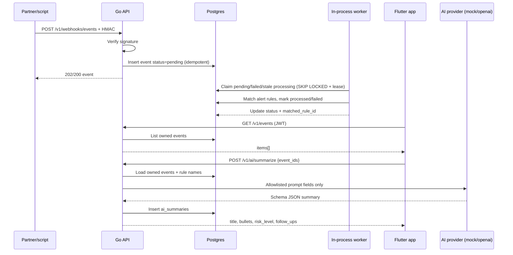

# Architecture

WalletOps Companion is a monorepo: Go API + Postgres worker-in-process, Flutter client.

```
[Flutter app]
    |  JSON + JWT
    v
[Go API] ---- auth / rules / events / ai.summarize
    |---- POST /webhooks/events (HMAC)
    v
[Postgres]
    ^
[Worker goroutine]
```

## Sequence: webhook → summarize



## Worker claim

1. Select one eligible row: `pending`, retriable `failed`, or `processing` whose `claimed_at` lease expired.
2. `FOR UPDATE SKIP LOCKED` so two API processes do not take the same row.
3. Set `status=processing` and refresh `claimed_at`.
4. Match rules / validate payload; mark `processed` or `failed` (clears `claimed_at`).

Default lease: 45s (`events.ClaimLease`). Health exposes queue counts via `GET /v1/health`.

## Packages (API)

| Path | Role |
|------|------|
| `internal/auth` | Register/login/refresh, JWT middleware |
| `internal/rules` | Alert rule CRUD + matching lookup |
| `internal/events` | Persist/list/claim events, queue stats |
| `internal/webhook` | HMAC ingest |
| `internal/worker` | Poll/claim/process loop |
| `internal/ai` | Mock/OpenAI summarize + audit row |

## Packages (mobile)

| Path | Role |
|------|------|
| `features/auth` | Session, login/register, secure tokens |
| `features/events` | List/detail, status chips |
| `features/rules` | List/create/edit |
| `features/explain` | Call summarize, render schema UI |
| `core/` | Dio, GetIt, go_router, theme |
